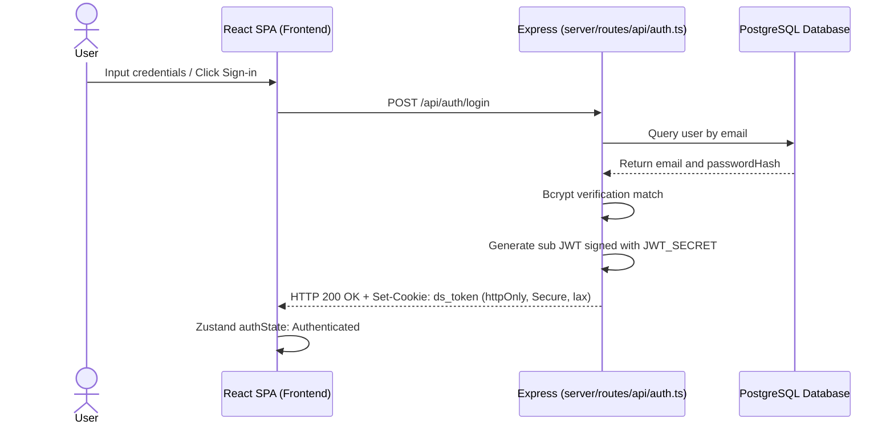
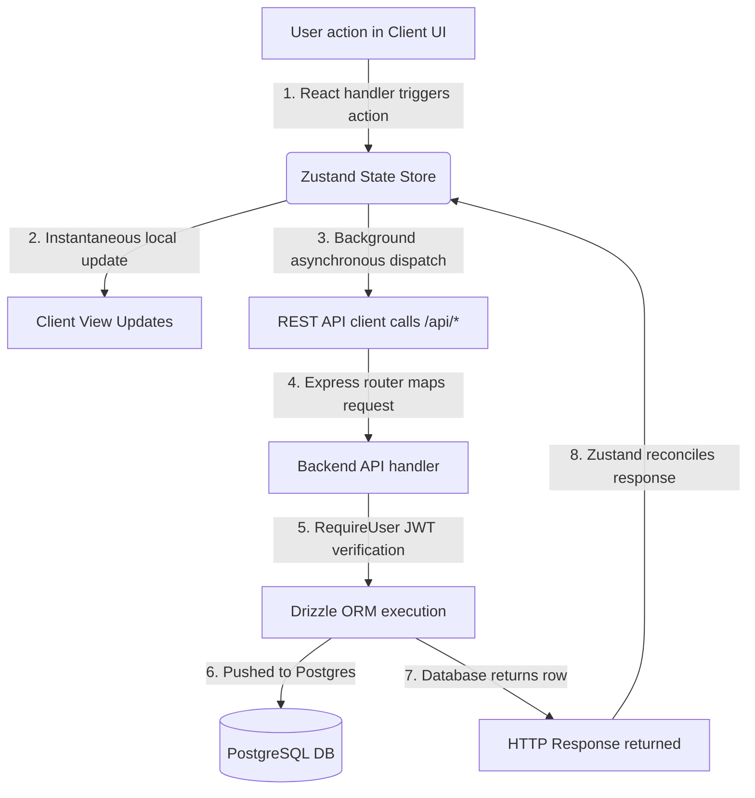

# 📐 System Architecture Overview

> [!NOTE]
> Dev Studio is built as a single-page application (SPA) with a lightweight, high-performance Express backend. This document maps out the system components, database schemas, authorization mechanisms, and full request-response data flows.

---

## 🗺️ System Component Diagram

Below is a architectural mapping of client-server communications, database relations, and API adapters:

```
┌──────────────────────────────────────────────────────────────┐
│                       Browser / Client                       │
│  React 19 · TanStack Router (file-based)                     │
│  TanStack Query (async hooks) · Zustand (persisted state)    │
│  Tailwind CSS v4 · shadcn/ui framework                       │
└──────────────┬───────────────────────────────▲───────────────┘
               │ fetch() / HTTP API            │ server cookies (JWT)
┌──────────────▼───────────────────────────────┴───────────────┐
               Express 5 Backend Server (server.ts)
   - JWT Cookie session verification & validation
   - Passport-based Google OAuth Integration
   - API endpoints forwarding requests to OpenAI models
└──────────────┬───────────────────────────────────────────────┘
               │ Drizzle ORM queries
┌──────────────▼───────────────────────────────────────────────┐
│                 PostgreSQL Database (Local)                  │
│  auth_users · prompts · agents · components · snippets       │
│  templates · connectors · social_drafts · mail_templates     │
│  interview_questions · user_progress · cv_profiles           │
└──────────────────────────────────────────────────────────────┘
```

---

## 🔐 Authentication Pipeline

Dev Studio implements robust, state-of-the-art authentication utilizing a secure JWT cookie-based session pattern alongside standard OAuth.

### Session Lifecycle



1. **Local Authentication**: Users register with their email and password. Passwords are salted and hashed (12 rounds of bcrypt) and stored in the database.
2. **Session Identification**: On successful login or registration, the backend signs a JSON Web Token (JWT) with the user ID (`sub` claim) signed with a secure `JWT_SECRET`.
3. **Cookie Storage**: The JWT is returned via a cookie named `ds_token` configured with security headers:
   - `httpOnly`: Protects the session token against Cross-Site Scripting (XSS).
   - `secure`: Transmitted exclusively over encrypted HTTPS requests (enabled in production).
   - `sameSite: lax`: Guards against Cross-Site Request Forgery (CSRF).
4. **Google OAuth 2.0**: Users can authenticate using Google login if client keys are set. On successful authentication, the server signs a JWT and redirects the user back to the application.

---

## 🔄 Dynamic Data Flow Pattern

Dev Studio employs a hybrid optimistic state management architecture where Zustand handles instantaneous frontend state transitions, synchronizing updates to PostgreSQL in the background.



---

## 💻 Tech Stack Properties

| Domain | Technology | Key Benefits |
|---|---|---|
| **Frontend Framework** | React 19 | High-performance component scheduling, stable functional hooks. |
| **State Store** | Zustand | Absolute control of state hydration, unified actions layer, zero boilerplate. |
| **Routing Manager** | TanStack Router | End-to-end type safety of page paths and query parameters. |
| **Data Fetching** | TanStack Query | Automatic polling, request caching, and automated revalidation. |
| **Styling Engine** | Tailwind CSS v4 | CSS-first configuration, theme token generation, utility speed. |
| **Server Engine** | Express 5 | Light overhead, asynchronous request support, middleware chain. |
| **Database Connector** | Drizzle ORM | Standard SQL querying, compiler checks, zero latency. |
| **Database Backend** | PostgreSQL | Enterprise-grade reliability, foreign keys, query optimization. |

---

## 📂 Core Architecture Files

* `server.ts` — Express engine bootstrapper, static SPA path resolvers, and hot module reloading middleware.
* `server/routes.ts` — Registering API routing namespaces.
* `server/middleware/auth.ts` — Verifying and verifying JWT cookie validity on endpoints.
* `server/db/index.ts` — Database connector configuring pool size.
* `shared/schema.ts` — Aggregated exports for all Drizzle model schema declarations.
* `src/lib/store.ts` — State-of-the-art Zustand store encapsulating all state and API action logic.
